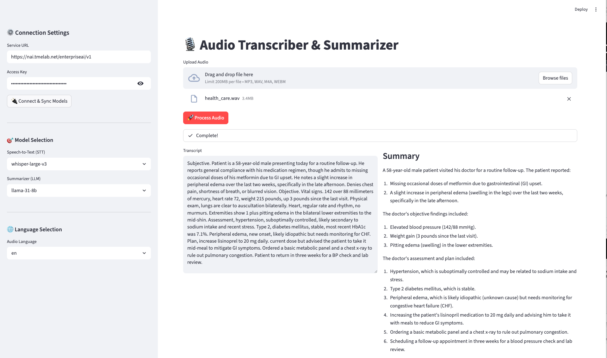

# Audio Transcription demo

This is an audio transcription demo that connects to LLMs hosted at an OpenAI-compatible endpoint.

## Install Python requirements

```
pip install -r requirements.txt
```

## Run app

```
streamlit run app.py
```

## Use app

1. Enter in your OpenAI-compatible endpoint and API key
2. Select the appropriate model from each drop-down
3. Specify the language
4. Upload a .wav, .opus, or .flac file

## Example



